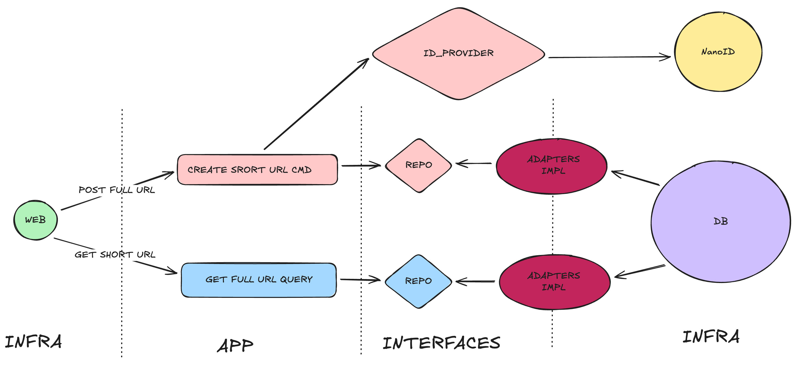

# rust-shortener-cqrs

## Architecture

[](docs/images/architecture.png)

[Architecture in Excalidraw](https://excalidraw.com/#json=pMIsbO0KML-Z4vO9A3y9B,69SSznF4i1F_5ggz0OoMrg)

## Start

```bash
cargo run
```

## Test

```bash
cargo test
```

## Dependencies

```bash
cargo add tokio -F "full"
cargo add axum
cargo add http-body-util
cargo add tower
```

## Build and start

```bash
cargo build --release
./target/release/rust-shortener-cqrs
```
